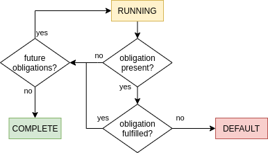

# Overview

## Introduction

The Crispy.finance Loan Framework \(CLF\) allows developers to quickly create, integrate and understand smart contract based loan agreements. In fact in most cases developers won't even have to write a single line of smart contract code because they can use existing loan templates.

## Existing templates

* **Minimum payment loan:** Loan where a minimum fixed payment has to be made per set time period to avoid foreclosure
* **Interest only loan**: Loan where only the interest has to be paid per set time period. The principal then has to be repaid in full at a certain date.
* **Minimum interest loan**: Only the interest has to be paid off. The borrower must repay the principal if he wants to recover his collateral but they must only pay off the interest to avoid foreclosure.
* **Liquidation protected DAO bond**: Debt instrument issued by a DAO where its assets are either partially or fully liquidated upon default.

There are sure to be future templates and even existing templates can be set up with a variety of parameters and conditions. 

## Core state management

The above diagram represents one of the core concept of the Crispy Loan Framework, every loan has 3 base states:

* **Running:** The agreement has not yet reached a final state. As an example a loan is in this state before it has been payed off.
* **Complete**: The agreement has been fulfilled and there are no further actions pending \(beyond the `_onComplete` hook\). As an example a loan is in this state once it has been payed off.
* **Default**: ****Some core part of the agreement has been violated and the agreement has halted. As an example if a borrower fails to make his owed payments his loan is closed. This is a **final** state

